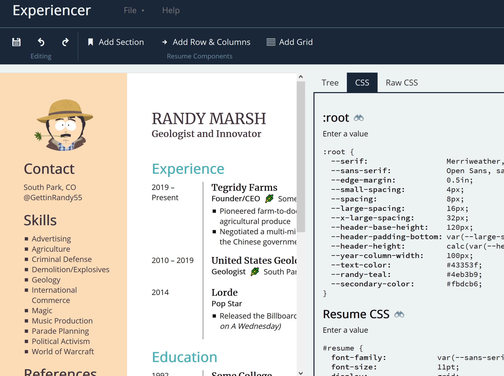

# Experiencer

**Are you tired of fighting with Microsoft Word? Want the power of HTML and CSS but less of the boilerplate?** Experiencer is an intuitive, flexible HTML & CSS based resume editor written using React supporting rich text, icons, and multiple-column layouts. While it would help to have working knowledge of CSS, the templates and CSS editor make this a great way to sharpen up your CSS skills without racking your brain.

[Example PDF Output](https://github.com/vincentlaucsb/experiencer/blob/master/Example%20PDF.pdf)

## Features
### Consistent, Predictable Layouts

When using Microsoft Word, Google Docs, and so on it always seems like the resume you labored so hard to get right is only one copy and paste away from complete destruction. On the other hand, Experiencer's consistent HTML output coupled with CSS styling enables the perfectionist in you to get the results you want.

### Less Angle Brackets, More Bullet Points

If you've ever tried editing an HTML or LaTeX resume you made ages ago, you've probably struggled to remember how all the different tags and styles go together. You may have even cursed your past self for not documenting all the CSS hackery you pulled off. With a WYSIWYG editor, you can format your resume with the precision of CSS styling without having to 
copy and paste `
` and `<section>` tags, or wade through deeply nested code, every time you want to add a new entry.

You get to focus on your content, and avoid hating yourself as well.

### Clean, Semantic HTML/CSS
The outputted HTML and CSS follows best practices, so if something doesn't go right, you won't be left debugging
a rat's nest of `
` tags or trying to figure out what `.css-class-2412husad-asda` does.

### Powerful CSS Editing
The CSS editor allows you to nest a set of rules within another, therefore giving you SASS-like abilities combined with instantaneous feedback. Other features include:
 * A highlighter which allows you to see what elements a selector applies to
 * Autocompletion for CSS property values, including variables you define
 * The ability to set IDs and additional classes for any resume item

## Use It Live

You can use this app live at [http://vincela.com/experiencer](http://vincela.com/experiencer).

## Thanks
 * [Feather Icons](https://feathericons.com/)
 * [IcoFont](https://icofont.com/)