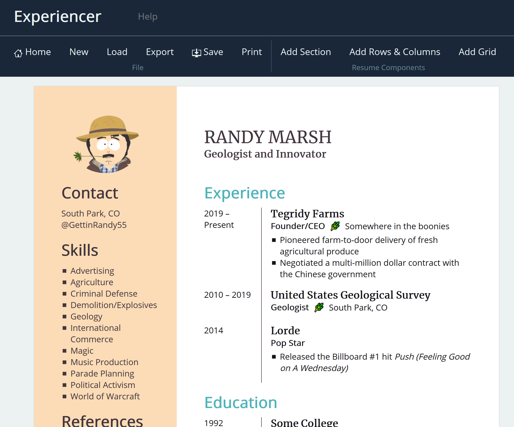

# Experiencer

**Are you tired of fighting with Microsoft Word? Want the power of HTML and CSS but less of the boilerplate?** Experiencer is an intuitive, flexible HTML & CSS based resume editor written using React supporting rich text, icons, and multiple-column layouts. While it would help to have working knowledge of CSS, the templates and CSS editor make this a great way to sharpen up your CSS skills without racking your brain.

[Example PDF Output](https://github.com/vincentlaucsb/experiencer/blob/master/Example%20PDF.pdf)

## Features
### Consistent, Predictable Layouts

When using Microsoft Word, Google Docs, and so on it always seems like the resume you labored so hard to get right is only one copy and paste away from complete destruction. On the other hand, Experiencer's consistent HTML output coupled with CSS styling enables the perfectionist in you to get the results you want.

### Less Angle Brackets, More Bullet Points

If you've ever tried editing an HTML or LaTeX resume you made ages ago, you've probably struggled to remember how all the different tags and styles go together. You may have even cursed your past self for not documenting all the CSS hackery you pulled off. With a WYSIWYG editor, you can format your resume with the precision of CSS styling without having to 
copy and paste `
` and `<section>` tags, or wade through deeply nested code, every time you want to add a new entry.

You get to focus on your content, and avoid hating yourself as well.

### Clean, Semantic HTML/CSS
The outputted HTML and CSS follows best practices, so if something doesn't go right, you won't be left debugging
a rat's nest of `
` tags or trying to figure out what `.css-class-2412husad-asda` does.

### Powerful CSS Editing
The CSS editor allows you to nest a set of rules within another, therefore giving you SASS-like abilities combined with instantaneous feedback. Other features include:
 * A highlighter which allows you to see what elements a selector applies to
 * Autocompletion for CSS property values, including variables you define
 * The ability to set IDs and additional classes for any resume item

## Use It Live

You can use this app live at [http://vincela.com/experiencer](http://vincela.com/experiencer).

## Thanks
 * [Feather Icons](https://feathericons.com/)
 * [IcoFont](https://icofont.com/)

## Available Scripts

In the project directory, you can run:

### `npm start`

Runs the app in the development mode. 
Open [http://localhost:3000](http://localhost:3000) to view it in the browser.

The page will reload if you make edits. 
You will also see any lint errors in the console.

### `npm test`

Launches the test runner in the interactive watch mode. 
See the section about [running tests](https://facebook.github.io/create-react-app/docs/running-tests) for more information.

### `npm run build`

Builds the app for production to the `build` folder. 
It correctly bundles React in production mode and optimizes the build for the best performance.

The build is minified and the filenames include the hashes. 
Your app is ready to be deployed!

See the section about [deployment](https://facebook.github.io/create-react-app/docs/deployment) for more information.

### `npm run eject`

**Note: this is a one-way operation. Once you `eject`, you can’t go back!**

If you aren’t satisfied with the build tool and configuration choices, you can `eject` at any time. This command will remove the single build dependency from your project.

Instead, it will copy all the configuration files and the transitive dependencies (Webpack, Babel, ESLint, etc) right into your project so you have full control over them. All of the commands except `eject` will still work, but they will point to the copied scripts so you can tweak them. At this point you’re on your own.

You don’t have to ever use `eject`. The curated feature set is suitable for small and middle deployments, and you shouldn’t feel obligated to use this feature. However we understand that this tool wouldn’t be useful if you couldn’t customize it when you are ready for it.

## Learn More

You can learn more in the [Create React App documentation](https://facebook.github.io/create-react-app/docs/getting-started).

To learn React, check out the [React documentation](https://reactjs.org/).

### Code Splitting

This section has moved here: https://facebook.github.io/create-react-app/docs/code-splitting

### Analyzing the Bundle Size

This section has moved here: https://facebook.github.io/create-react-app/docs/analyzing-the-bundle-size

### Making a Progressive Web App

This section has moved here: https://facebook.github.io/create-react-app/docs/making-a-progressive-web-app

### Advanced Configuration

This section has moved here: https://facebook.github.io/create-react-app/docs/advanced-configuration

### Deployment

This section has moved here: https://facebook.github.io/create-react-app/docs/deployment

### `npm run build` fails to minify

This section has moved here: https://facebook.github.io/create-react-app/docs/troubleshooting#npm-run-build-fails-to-minify
